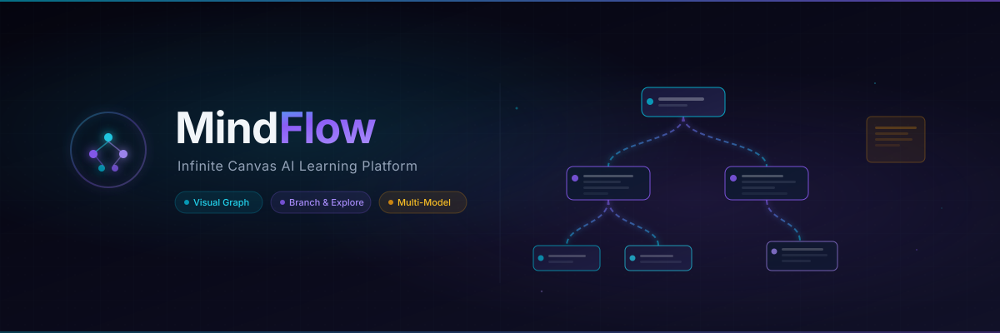

<p align="center">
  
</p>

<h1 align="center">MindFlow</h1>

<p align="center">
  <strong>Infinite Canvas AI Learning Platform</strong>
</p>

<p align="center">
  <a href="#-features">Features</a> &nbsp;&bull;&nbsp;
  <a href="#%EF%B8%8F-tech-stack">Tech Stack</a> &nbsp;&bull;&nbsp;
  <a href="#-getting-started">Getting Started</a> &nbsp;&bull;&nbsp;
  <a href="#-how-to-use">How to Use</a>
</p>

<p align="center">
  
  
  
  
</p>

---

MindFlow is a modern, open-source AI learning platform that replaces traditional linear chat with an **infinite, explorable visual graph**. Every question, answer, and annotation becomes a node in a living knowledge map — helping users think, learn, and research visually.

## ✨ Features

- **Infinite Canvas**: Pan, zoom, and explore your learning sessions freely.
- **Highlight-to-Branch**: Select any text in an AI response to create a specific follow-up branch, keeping tangents isolated from the main flow.
- **Multi-Model Support**: Use OpenAI (GPT-4o), Anthropic (Claude Sonnet 4.5), or Google (Gemini 1.5).
- **Hybrid Auth Mode**: 
  - **Platform Hosted**: Log in with Google/GitHub and use the platform's API keys.
  - **Bring Your Own Key (BYOK)**: Don't want to log in? Just paste your own API key in settings.
- **Context-Aware**: The AI walks up the graph tree to build context, meaning it always knows the exact branch of the conversation you are continuing.
- **Auto-Layout**: Dagre-powered tree layout keeps your complex graphs organized automatically.

## 🛠️ Tech Stack

- **Framework**: Next.js 15 (App Router)
- **Canvas**: React Flow (`@xyflow/react`)
- **State Management**: Zustand (with local storage persistence)
- **AI SDK**: Vercel AI SDK (`ai`, `@ai-sdk/openai`, `@ai-sdk/anthropic`, `@ai-sdk/google`)
- **Authentication**: NextAuth.js (Auth.js v5)
- **Styling**: Vanilla CSS with modern Glassmorphism and CSS Variables
- **Icons**: Lucide React

## 🚀 Getting Started

### 1. Clone the repository
```bash
git clone https://github.com/saaga112/mindflow.git
cd mindflow
```

### 2. Install dependencies
```bash
npm install
```

### 3. Environment Variables
Create an `.env.local` file in the root directory:
```env
# Generate a secret: npx auth secret
AUTH_SECRET="your-secret-here"

# Optional: For Platform Hosted mode
AUTH_GITHUB_ID="your-github-id"
AUTH_GITHUB_SECRET="your-github-secret"
AUTH_GOOGLE_ID="your-google-id"
AUTH_GOOGLE_SECRET="your-google-secret"

OPENAI_API_KEY="sk-..."
ANTHROPIC_API_KEY="sk-ant-..."
GOOGLE_GENERATIVE_AI_API_KEY="AIza..."
```

### 4. Run the development server
```bash
npm run dev
```

Open [http://localhost:3000](http://localhost:3000) in your browser.

## 💡 How to use

1. Open settings (⚙️) and choose your preferred model.
2. Type a question in the bottom input bar to start a flow.
3. Highlight any interesting text in the AI's response and click "Ask about this" to branch off.
4. Add sticky notes using the toolbar to annotate your graph.
5. Use the layout button in the toolbar to auto-arrange messy nodes.
